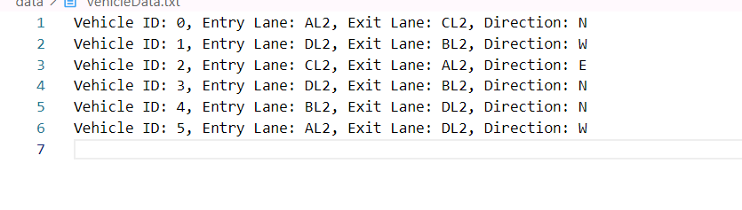
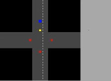

# DSA QUEUE SIMULATOR 🚘🚥
# Author: [Pratistha Thapa]

## Overview:
This code is a simple implementation of a queue data structure using C and SDL3. 
It inclues a simulation of a 4 junction road with 3 lanes on each. This program uses linear data structures, specifically queues, to manage vehicles at the junction under different conditions, including normal and high-priority scenarios.


-The system simulates the traffic flow through four major roads, each having three lanes:

-**Normal Condition:** All lanes are served equally, based on the number of waiting vehicles.
-**High-Priority Condition:** When a road accumulates more than 10 vehicles in the priority lane, that lane is served until the number of waiting vehicles drops below 5, after which normal traffic management resumes.


## Key Features:
- Simulation of a traffic management system using queues.
- Visualization of vehicle queues and traffic lights in a real-time simulation.
- Priority management for specific lanes with a larger number of waiting vehicles.
- Handling of both incoming and outgoing lanes.
- Red and green light simulation to prevent deadlock at the junction.

### Algorithms Used
-**Queue Operations:** Standard enqueue and dequeue operations for handling vehicles.
-**Priority Lane:** When the vehicle count exceeds 10, it is served first until the count drops below 5, at which point normal 
conditions resume.

## Description
### Vehicle generator
 Vehicle and its data are randomly generated by the vehicle_generator file. All the data like entry lane and exit lane  is selected at random and is stored in the vechicleData file. 


### Queue Implementation
-**Vehicle Queue:** Each road (A, B, C, D) has a corresponding vehicle queue. Vehicles are enqueued as they are generated and dequeued when they pass through the junction.
-**Lane Queue:** A priority queue manages the lanes. If a specific lane (like AL2) exceeds 10 waiting vehicles, it is given the highest priority.

### Simulator
The simulator is implemented using SDL3. It displays the road network with 4 junctions and traffic light managing the passing and enqueing of the vechicle also ensuring that lanes with excessive traffic were given priority.



# How to run this Project

1. Clone this github repo

```bash
git clone https://github.com/Pratistha88/dsa-queue-simulator.git
```

Make sure **make** command works on your local machine

2. Steps to run the program

Initially clear the data from **(./data/vehicles.txt)**

then run:

```bash
make
```

after open a terminal and paste this:

```bash
./simulator
```

then open another terminal and paste this:

```bash
./generator
```

This will help you run the program.
